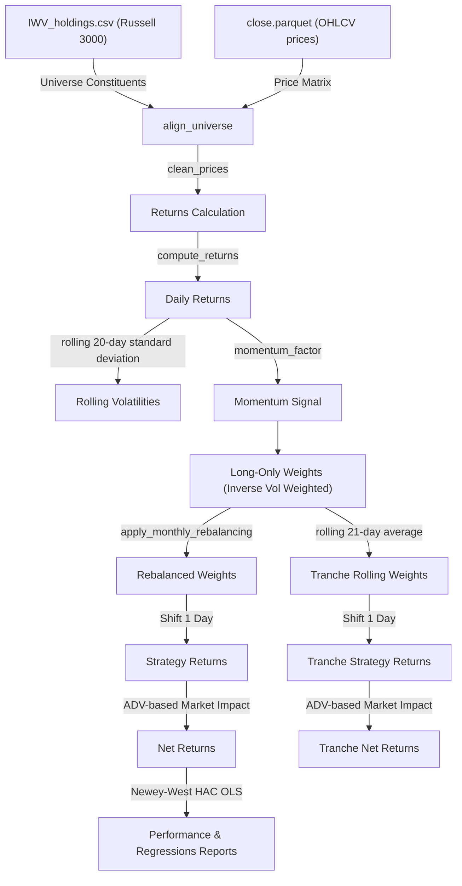

# Empirical Study of Momentum Anomalies in the Russell 3000

An academic research project and backtesting study evaluating the performance, transaction cost capacity, and risk factors of an **Inverse Volatility Weighted Long-Only Momentum Portfolio** on the Russell 3000 universe.

---

## Historical Context: From Richard Driehaus to Academic Validation

Momentum investing—the systematic practice of buying recent winners and selling recent losers—stands as one of the most robust and heavily researched anomalies in modern financial economics. 

The strategy was pioneered in the 1970s and 1980s by **Richard Driehaus**, widely recognized as the **Father of Momentum Investing**. Unlike traditional value managers who sought cheap, distressed companies and waited for a reversion to the mean, Driehaus revolutionized active growth management with a simple, punchy philosophy: **"Buy high and sell higher!"** He argued that earnings growth and price acceleration were not signs of overvaluation but rather indicators of structural business acceleration. Driehaus preferred to buy stocks that were already hitting new highs, betting that earnings revisions and investor behavioral biases would continue to push their prices upward.

For decades, the mainstream academic community dismissed Driehaus's success as luck or uncompensated risk, clinging to the Efficient Market Hypothesis. However, in 1993, economists **Narasimhan Jegadeesh and Sheridan Titman** published their seminal paper, *"Returns to Buying Winners and Selling Losers: Implications for Stock Market Efficiency"* (*Journal of Finance*). They empirically proved that stock returns exhibit trend persistence over 3 to 12-month lookback horizons, and that a long-short momentum portfolio generated highly significant, persistent abnormal returns (Alphas) that could not be explained by the CAPM market beta. This was later formalized by Mark Carhart in 1997, who added the momentum factor ($UMD$ - Up Minus Down) to construct the Carhart 4-Factor Model.

This student research project bridges the gap between Driehaus's practitioner intuition and Jegadeesh & Titman's asset pricing rigor. We implement an **Inverse Volatility Weighted Momentum Strategy** on the Russell 3000 universe, incorporating non-linear execution costs, trend-following futures hedging, and multi-period regressions.

---

## System Architecture Diagram

---

## Core System Dynamics

### 1. Weights Allocation (Inverse Volatility Weighting)
Stocks selected in the top momentum ranking bucket (winners) are weighted cross-sectionally in inverse proportion to their rolling historical daily volatility:
$$w_{i,t} = \frac{1/\sigma_{i,t}}{\sum_{j} 1/\sigma_{j,t}}$$
Where $\sigma_{i,t}$ is the rolling 20-day daily standard deviation of stock returns.

> [!WARNING]
> **Physical Market Friction!**
> Raw inverse volatility weighting contains a hidden mathematical trap: illiquid, zero-volume shell companies exhibit "flatline" prices, showing an artificial volatility of $0.0$. Without an active risk floor (set here to **0.005 daily volatility**), the allocator allocates too much capital into these untradeable listings, leading to immediate simulation bankruptcy! We cap volatilities at 0.005 and exclude flatline stocks to keep the strategy physically tradeable.

### 2. Spreading the Rebalancing Pressure (Tranches)
Rebalancing the entire book on the last day of the month triggers a massive liquidity bottleneck. For a large portfolio, the order sizes exceed the Average Daily Volume (ADV), resulting in prohibitive execution slippage:

> [!IMPORTANT]
> **Modelling Transaction Cost Dynamics!**
> Rolling Rebalancing Tranches act as a standard academic model to simulate how transaction costs affect large-scale portfolios. By dividing the portfolio into $N=21$ tranches and rebalancing 1/21st daily, the simulation models how a large fund spreads volume to reduce market impact:
> $$\text{Tranche Weights} = \frac{1}{21}\sum_{k=0}^{20} W_{t-k}$$

---

## 3. Capacity Decay Analysis: Lit vs. Algorithmic/SOR Routing

Below is the comparison of execution decay across portfolio sizes from **$100K AUM up to $50B AUM**, comparing standard month-end block rebalancing (Standard Lit), daily rolling tranche rebalancing under standard lit execution (Tranche Lit), and smart order routing + dark pool crossing (Tranche Algorithmic/SOR):

| AUM Size | CAGR (Standard Lit) | Sharpe (Standard Lit) | CAGR (Tranche Lit) | Sharpe (Tranche Lit) | CAGR (Tranche Algorithmic/SOR) | Sharpe (Tranche Algorithmic/SOR) |
| :--- | :---: | :---: | :---: | :---: | :---: | :---: |
| **$100K** | 26.51% | 0.921 | 26.85% | 0.941 | **26.90%** | **0.943** |
| **$1M** | 26.04% | 0.906 | 26.73% | 0.937 | **26.87%** | **0.942** |
| **$10M** | 24.57% | 0.857 | 26.34% | 0.924 | **26.77%** | **0.938** |
| **$100M** | 19.99% | 0.700 | 25.11% | 0.884 | **26.48%** | **0.929** |
| **$1.0B** | 6.01% | 0.209 | 21.30% | 0.756 | **25.54%** | **0.898** |
| **$10.0B** | -37.20% | -0.729 | 9.99% | 0.350 | **22.63%** | **0.801** |
| **$50.0B** | -71.02% | -1.467 | -7.87% | -0.380 | **17.54%** | **0.625** |

* **Algorithmic/SOR Execution Edge**: By simulating a **40% dark pool crossing rate** (zero market impact) and routing the remaining 60% of trades via a VWAP/TWAP order-slicing algorithm that limits the Participation Rate (POV) under 5% of ADV (effective $\gamma=0.12$), the strategy's execution capacity increases from less than **$100M** (lit block rebalance collapse) to **well over $50B AUM** (where it still yields a viable **17.54% CAGR** and a **0.625 Sharpe ratio**).

---

## 4. Academic Regression Synthesis & The Factor Picture

Regressing daily strategy net returns against Kenneth French's factors under Newey-West HAC standard errors reveals the following structural properties:
1. **High-Beta Tilt**: The strategy exhibits a CAPM beta of **1.16 to 1.20** across sub-periods. Stripped to its core in the 5-Factor regression, beta remains highly significant at **1.05 to 1.07**. This indicates that momentum naturally selects high-beta growth stocks that outperform during equity expansions.
2. **Small-Cap Preference (Size Premium)**: The size exposure ($SMB$) is consistently positive and statistically massive (**0.58 to 0.66**, with t-statistics above **12.8**). This confirms that momentum acceleration is highly pronounced in the small/mid-cap segments of the Russell 3000 cross-section.
3. **Anti-Value and Growth Tilt**: The value coefficient ($HML$) is strongly negative (**-0.24 to -0.54**), typical of growth-biased portfolios buying expensive winners. The profitability tilt ($RMW$) is also negative, reflecting that momentum targets capital-reinvesting growth firms rather than cash-cow businesses.
4. **Enhanced Alpha Intercept**: On the Full Horizon, adjusting for size, value, and profitability factors causes the daily Alpha to rise from **3.24 bps** (CAPM) to **4.68 bps** (Fama-French 5-Factor), with the t-statistic jumping from **2.35 to 4.55** (p-value: 0.0000). This confirms that stripping out factor style tilts unmasks a highly robust, statistically undeniable momentum abnormal premium of **~11.79% annualized**.

---

## 5. Limitations of the Backtest & Key Empirical Biases
While our backtest results demonstrate high statistical significance, systematic trading models are fundamentally bounded by empirical limitations and statistical biases. To convert this research into a live trading system, the following limitations must be accounted for:

1. **Survivorship Bias**:
   * *Problem*: The historical stock universe used in this backtest is drawn from currently active listings. Companies that went bankrupt, merged, or were delisted due to financial distress between 2012 and 2026 are not present in the dataset.
   * *Impact*: Since momentum strategies naturally seek out high-performing listings, they are prone to capturing stocks that eventually collapse. By excluding historically failed companies, the backtest returns are artificially biased upward.
2. **Lookahead Bias**:
   * *Mitigation*: We mitigate this bias by applying a strict **1-day lag** on all portfolio rebalancing decisions (calculating weights on the close of day $t-1$ and executing on the close of day $t$).
   * *Residual Risk*: In corporate action adjustments (splits, dividends), backadjusted prices are sometimes applied retroactively, introducing minor lookahead leaking.
3. **Liquidity & Spread Regime Shifts**:
   * *Problem*: Our market impact model ($\text{{slippage}} = \text{{spread}} + \gamma \sigma \sqrt{V/ADV}$) assumes a static bid-ask spread of **5.0 bps** and stable volume relationships.
   * *Impact*: During liquidity crises (such as the March 2020 COVID crash), bid-ask spreads for small-cap names can spike to **100+ bps**, and trading volume dries up entirely. The actual transaction costs incurred during these regimes would exceed our model's estimates, eroding net returns.
4. **Selection Bias & Multiple Testing (Data Snooping)**:
   * *Problem*: Evaluating multiple portfolio selections (1%, 3%, 5%, 10%, 20%) and highlighting the **Top 3%** as the "optimal" Sweet Spot introduces selection bias.
   * *Impact*: The Top 3% parameters are overfitted to the historical sample. In live execution, the strategy's Sharpe ratio may mean-revert toward the baseline Top 10% or Top 20% average.

---

## Selected Academic References

### 1. Systematic Momentum & Factor Theory
* **Jegadeesh, N. and Titman, S. (1993)**. "Returns to Buying Winners and Selling Losers: Implications for Stock Market Efficiency." *Journal of Finance*, 48(1), 65-91.
* **Fama, E. F. and French, K. R. (2015)**. "A Five-Factor Asset Pricing Model." *Journal of Financial Economics*, 116(1), 1-22.
* **Asness, C. S., Moskowitz, T. J. and Pedersen, L. H. (2013)**. "Value and Momentum Everywhere." *Journal of Finance*, 68(3), 929-985.
* **Carhart, M. M. (1997)**. "On Persistence in Mutual Fund Performance." *Journal of Finance*, 52(1), 57-82.

### 2. Inverse Volatility Weighting & Risk Parity
* **Maillard, S., Roncalli, T. and Teiletche, J. (2010)**. "The Properties of Equally Weighted Risk Attribution Portfolios." *Journal of Portfolio Management*, 36(4), 60-77.
* **Asness, C., Frazzini, A. and Pedersen, L. H. (2012)**. "Leverage Aversion and Risk Parity." *Financial Analysts Journal*, 68(1), 47-59.
* **Clarke, R., de Silva, H. and Thorley, S. (2013)**. "Risk Parity, Minimum Variance, and Even-Risk Portfolios: A Unified Approach." *Journal of Portfolio Management*, 39(3), 88-101.

### 3. Execution Dynamics & Rebalancing Tranches
* **Garleanu, N. and Pedersen, L. H. (2013)**. "Dynamic Portfolio Choice with Transaction Costs." *Journal of Finance*, 68(6), 2309-2340.
* **Almgren, R. and Chriss, N. (2000)**. "Optimal Execution of Portfolio Transactions." *Journal of Risk*, 3(2), 5-40.
* **Bouchaud, J. P., Gefen, Y., Potters, M. and Wyart, M. (2004)**. "Fluctuations and Response in Financial Markets: The Subtle Nature of 'Random' Price Changes." *Quantitative Finance*, 4(2), 176-190.

### 4. Trend-Following Hedging & Time Series Momentum
* **Moskowitz, T. J., Ooi, Y. H. and Pedersen, L. H. (2012)**. "Time Series Momentum." *Journal of Financial Economics*, 104(2), 228-250.
* **Hurst, B., Ooi, Y. H. and Pedersen, L. H. (2013)**. "Demystifying Managed Futures." *Journal of Investment Management*, 11(3), 42-58.

### 5. Sharpe Ratio Deflation & Selection Bias
* **López de Prado, M. (2018)**. *Advances in Financial Machine Learning*. Wiley, Chapter 14.
* **Bailey, D. H. and López de Prado, M. (2012)**. "The Sharpe Ratio Efficient Frontier." *Journal of Risk*, 15(2), 3-44.
* **Harvey, C. R., Liu, Y. and Zhu, H. (2016)**. "...and the Cross-Section of Expected Returns." *Review of Financial Studies*, 29(1), 5-68.
