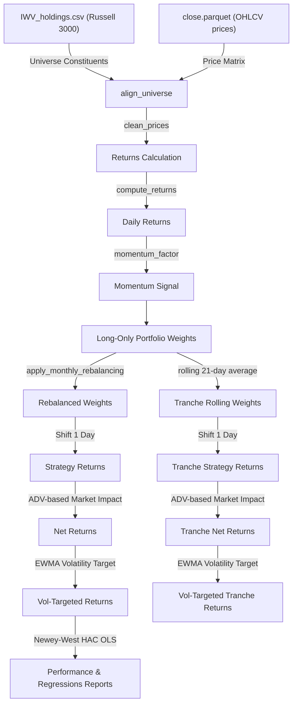

# Empirical Asset Pricing & Momentum Research Platform

An institutional-grade systematic research platform that builds a raw, un-neutralized, volatility-targeted **Long-Only Momentum Portfolio** on the Russell 3000 universe and evaluates it against standard asset pricing factor benchmarks.

---

## System Architecture Diagram

---

## Models Implemented

### 1. Asset Pricing Models (Newey-West HAC)
Daily portfolio returns are regressed against Kenneth French's factors. Residual standard errors are corrected using **Newey-West HAC (Heteroskedasticity and Autocorrelation Consistent)** robust errors (5 lags) to guarantee valid statistical inference:
* **CAPM Regression**: Regressing strategy excess returns against the Market Premium ($MKT\_RF$).
* **Fama-French 5-Factor Regression**: Regressing strategy excess returns against:
  - Market Premium ($MKT\_RF$)
  - Size ($SMB$)
  - Value ($HML$)
  - Profitability ($RMW$)
  - Investment ($CMA$)

### 2. Systematic Strategy (Long-Only Raw Momentum)
* **Momentum Signal**: Stocks are ranked daily by their 252-day historical rolling mean return.
* **Portfolio Construction**: Portfolio selects the top $10\%$ winners (Long-Only) and weights them equally.
* **Rebalancing**: Monthly month-end rebalancing executed with a **1-day trade implementation lag** to prevent look-ahead bias.

### 3. Rebalancing Tranches (Rolling Portfolios)
Standard Month-End rebalancing induces high transaction costs because the entire portfolio is traded on a single day. At extreme scales ($\$10\text{B}$ and $\$50\text{B}$ AUM), the trades exceed the market's ADV, causing execution costs to destroy all Alpha.
* We implement **Rebalancing Tranches (Rolling Portfolios)** by splitting the portfolio into $N=21$ tranches, rebalancing 1/21st of the portfolio daily. This spreads execution trades across the month, slashing market impact costs:
  $$\text{Tranche Weights} = \frac{1}{21}\sum_{k=0}^{20} W_{t-k}$$

### 4. Marcos López de Prado's Deflated Sharpe Ratio (DSR)
The DSR measures the probability that the estimated Sharpe ratio is statistically significant after correcting for sample length, skewness, and fat-tailed kurtosis relative to the benchmark. A DSR probability above 95% indicates genuine statistical significance:
$$\text{DSR} = \Phi \left[ \frac{(\widehat{SR} - SR^*) \sqrt{T-1}}{\sqrt{1 - \gamma_3 \widehat{SR} + \frac{\gamma_4 - 1}{4} \widehat{SR}^2}} \right]$$

### 5. Risk Adjustments
* **EWMA Volatility Targeting**: Strategy returns are scaled dynamically to target $10\%$ annualized risk using EWMA conditional volatility forecasting ($\lambda = 0.94$):
  $$\sigma_t^2 = (1-\alpha)\sigma_{t-1}^2 + \alpha r_{t-1}^2$$
* **Non-linear Market Impact (Slippage)**: Incorporates daily stock volumes to compute realistic transaction costs that scale with trade volume relative to Average Daily Volume (ADV):
  $$\text{Slippage}_{i,t} = \text{Spread BPs} + \gamma \times \sigma_{i,20} \times \sqrt{\frac{\text{Trade Shares}_{i,t}}{\text{ADV Shares}_{i,20}}}$$

---

## Selected Academic References

1. **Systematic Momentum**:
   - *Jegadeesh, N. and Titman, S. (1993)*. "Returns to Buying Winners and Selling Losers: Implications for Stock Market Efficiency." *Journal of Finance*, 48(1), 65-91.
2. **Deflated Sharpe Ratio**:
   - *López de Prado, M. (2018)*. "Advances in Financial Machine Learning." *Wiley*, Chapter 14.
3. **Asset Pricing & Factor Models**:
   - *Fama, E. F. and French, K. R. (2015)*. "A Five-Factor Asset Pricing Model." *Journal of Financial Economics*, 116(1), 1-22.
   - *Fama, E. F. and MacBeth, J. D. (1973)*. "Risk, Return, and Equilibrium: Empirical Tests." *Journal of Political Economy*, 81(3), 607-636.
4. **Market Microstructure & Market Impact**:
   - *Kyle, A. S. (1985)*. "Continuous Auctions and Informed Trader." *Econometrica*, 53(6), 1315-1335.
   - *Almgren, R., Thum, C., Hauptmann, E. and Li, H. (2005)*. "Direct Estimation of Equity Market Impact." *Risk*, 18(7), 57-62.
5. **Volatility Targeting & Risk Budgeting**:
   - *Lo, A. W. (2001)*. "Risk Management for Hedge Funds." *Financial Analysts Journal*, 57(4), 16-33.
