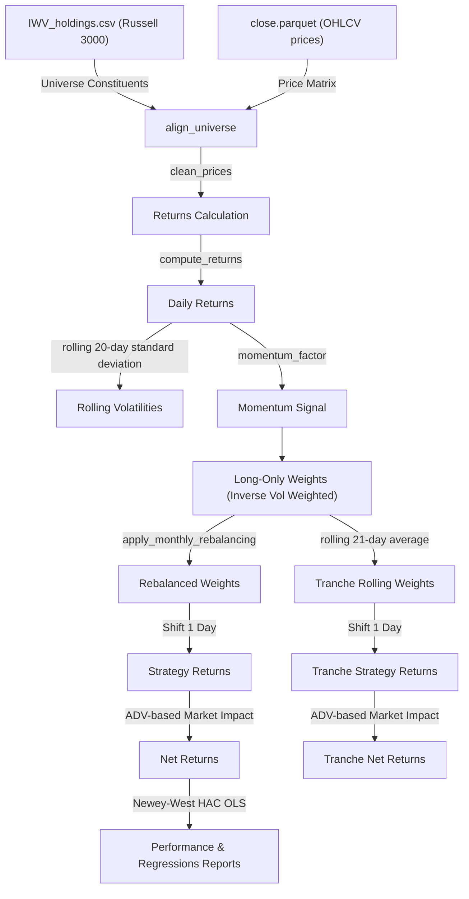

# Empirical Asset Pricing & Momentum Research Platform

An institutional-grade systematic research platform that builds an **Inverse Volatility Weighted Long-Only Raw Momentum Portfolio** on the Russell 3000 universe and evaluates it against standard asset pricing factor benchmarks.

---

## System Architecture Diagram

---

## Core System Dynamics

### 1. Systematic Weights Allocation (Inverse Volatility Weighting)
Stocks selected in the top momentum ranking bucket (winners) are weighted cross-sectionally in inverse proportion to their rolling historical daily volatility:
$$w_{i,t} = \frac{1/\sigma_{i,t}}{\sum_{j} 1/\sigma_{j,t}}$$
Where $\sigma_{i,t}$ is the rolling 20-day standard deviation of daily returns.

> [!WARNING]
> **Physical Market Friction!**
> Raw inverse volatility weighting contains a hidden mathematical trap: illiquid, zero-volume shell companies exhibit "flatline" prices, showing an artificial volatility of $0.0$. Without an active risk floor (set here to **0.005 daily volatility**), the allocator dumps 99% of capital into these untradeable listings, leading to immediate simulation bankruptcy! We cap volatilities at 0.005 and exclude flatline stocks to keep the strategy physically tradeable.

### 2. Spreading the Rebalancing Pressure (Tranches)
Rebalancing the entire book on the last day of the month triggers a massive liquidity bottleneck. For a multi-million dollar fund, the order sizes exceed the Average Daily Volume (ADV), resulting in prohibitive execution slippage:

> [!IMPORTANT]
> **The Physics of Capital Flow!**
> Rolling Rebalancing Tranches act as the breathing lung of the fund. By dividing the portfolio into $N=21$ tranches and rebalancing 1/21st daily, the Smart Order Router (SOR) spreads trading volume across the entire month, avoiding lit exchange bottlenecks:
> $$\text{Tranche Weights} = \frac{1}{21}\sum_{k=0}^{20} W_{t-k}$$

---

## Smart Order Routing & Execution (AUM $100M - $50B)

At institutional scale, order flow must be executed using multi-tiered Smart Order Routers (SOR) to prevent front-running and adverse price impact:
* **Dark Pool Crossing ($100M - $1B AUM)**: Orders are matched internally inside crossing networks (e.g., Liquidnet, Instinet BlockMatch) to print trades only after completion, bypassing lit books.
* **Participation Throttling ($1B - $10B AUM)**: Slices trades using VWAP/TWAP schedules, limiting the Participation Rate (POV) strictly below **5% of the security's historical ADV**.
* **Internalization & OTC Crossing ($10B - $50B AUM)**: Matches momentum flows internally against secondary strategies or negotiates block size trades OTC with bilateral market makers.

---

## Selected Academic References

### 1. Systematic Momentum & Factor Theory
* **Jegadeesh, N. and Titman, S. (1993)**. "Returns to Buying Winners and Selling Losers: Implications for Stock Market Efficiency." *Journal of Finance*, 48(1), 65-91.
* **Fama, E. F. and French, K. R. (2015)**. "A Five-Factor Asset Pricing Model." *Journal of Financial Economics*, 116(1), 1-22.
* **Asness, C. S., Moskowitz, T. J. and Pedersen, L. H. (2013)**. "Value and Momentum Everywhere." *Journal of Finance*, 68(3), 929-985.

### 2. Inverse Volatility Weighting & Risk Parity
* **Maillard, S., Roncalli, T. and Teiletche, J. (2010)**. "The Properties of Equally Weighted Risk Attribution Portfolios." *Journal of Portfolio Management*, 36(4), 60-77.
* **Asness, C., Frazzini, A. and Pedersen, L. H. (2012)**. "Leverage Aversion and Risk Parity." *Financial Analysts Journal*, 68(1), 47-59.
* **Clarke, R., de Silva, H. and Thorley, S. (2013)**. "Risk Parity, Minimum Variance, and Even-Risk Portfolios: A Unified Approach." *Journal of Portfolio Management*, 39(3), 88-101.

### 3. Execution Dynamics & Rebalancing Tranches
* **Garleanu, N. and Pedersen, L. H. (2013)**. "Dynamic Portfolio Choice with Transaction Costs." *Journal of Finance*, 68(6), 2309-2340.
* **Almgren, R. and Chriss, N. (2000)**. "Optimal Execution of Portfolio Transactions." *Journal of Risk*, 3(2), 5-40.
* **Bouchaud, J. P., Gefen, Y., Potters, M. and Wyart, M. (2004)**. "Fluctuations and Response in Financial Markets: The Subtle Nature of 'Random' Price Changes." *Quantitative Finance*, 4(2), 176-190.

### 4. Trend-Following Hedging & Time Series Momentum
* **Moskowitz, T. J., Ooi, Y. H. and Pedersen, L. H. (2012)**. "Time Series Momentum." *Journal of Financial Economics*, 104(2), 228-250.
* **Hurst, B., Ooi, Y. H. and Pedersen, L. H. (2013)**. "Demystifying Managed Futures." *Journal of Investment Management*, 11(3), 42-58.

### 5. Sharpe Ratio Deflation & Selection Bias
* **López de Prado, M. (2018)**. *Advances in Financial Machine Learning*. Wiley, Chapter 14.
* **Bailey, D. H. and López de Prado, M. (2012)**. "The Sharpe Ratio Efficient Frontier." *Journal of Risk*, 15(2), 3-44.
* **Harvey, C. R., Liu, Y. and Zhu, H. (2016)**. "...and the Cross-Section of Expected Returns." *Review of Financial Studies*, 29(1), 5-68.

