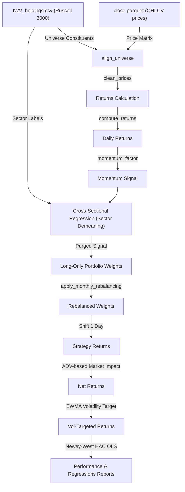

# Empirical Asset Pricing & Momentum Research Platform

An institutional-grade systematic research platform that builds a sector-neutralized, volatility-targeted **Long-Only Momentum Portfolio** on the Russell 3000 universe and evaluates it against standard asset pricing factor benchmarks.

---

## System Architecture Diagram



---

## Models Implemented

### 1. Asset Pricing Models (Newey-West HAC)
Daily portfolio returns are regressed against Kenneth French's factors. Residual standard errors are corrected using **Newey-West HAC (Heteroskedasticity and Autocorrelation Consistent)** robust errors (5 lags) to guarantee valid statistical inference:
* **CAPM Regression**: Regressing strategy excess returns against the Market Premium ($MKT\_RF$).
* **Fama-French 5-Factor Regression**: Regressing strategy excess returns against:
  - Market Premium ($MKT\_RF$)
  - Size ($SMB$)
  - Value ($HML$)
  - Profitability ($RMW$)
  - Investment ($CMA$)

### 2. Systematic Strategy (Long-Only Sector-Neutral Momentum)
* **Momentum Signal**: Stocks are ranked daily by their 252-day historical rolling mean return.
* **Sector Neutralization (Residual Momentum)**: To eliminate sector crowding and exposure to sudden industry rotations, the raw momentum signal is cross-sectionally de-meaned within its sector cohort daily:
  $$R_{i,t} = \text{Signal}_{i,t} - \frac{1}{N_s}\sum_{j \in S_i} \text{Signal}_{j,t}$$
* **Portfolio Construction**: Portfolio selects the top $10\%$ winners (Long-Only) and weights them equally.
* **Rebalancing**: Monthly month-end rebalancing executed with a **1-day trade implementation lag** to prevent look-ahead bias.

### 3. Risk Adjustments
* **EWMA Volatility Targeting**: Strategy returns are scaled dynamically to target $10\%$ annualized risk using EWMA conditional volatility forecasting ($\lambda = 0.94$):
  $$\sigma_t^2 = (1-\alpha)\sigma_{t-1}^2 + \alpha r_{t-1}^2$$
* **Non-linear Market Impact (Slippage)**: Incorporates daily stock volumes to compute realistic transaction costs that scale with trade volume relative to Average Daily Volume (ADV):
  $$\text{Slippage}_{i,t} = \text{Spread BPs} + \gamma \times \sigma_{i,20} \times \sqrt{\frac{\text{Trade Shares}_{i,t}}{\text{ADV Shares}_{i,20}}}$$

---

## Getting Started

### 1. Install Dependencies
```bash
pip install -r requirements.txt
```

### 2. Prepare Data
Ensure `IWV_holdings.csv` (which provides the Russell 3000 constituent universe and sectors) is placed on your **Desktop**. Then run:
```bash
python scripts/prepare_data.py
```
*Note: This script automatically downloads historical daily price and volume data directly from Yahoo Finance using `yfinance`. If Yahoo rate limits are encountered, it automatically falls back to copying and compiling local database CSV files.*

### 3. Run Simulation & Analysis
```bash
python main.py
```
This runs the main sector-neutral backtest, simulates capacity decay across AUM sizes from $\$10\text{M}$ to $\$1\text{B}$, executes Fama-French regressions, and saves performance summaries and equity curve charts to `results/` and `reports/`.

---

## MIT-Level Academic References

1. **Systematic Momentum & Residual Momentum**:
   - *Jegadeesh, N. and Titman, S. (1993)*. "Returns to Buying Winners and Selling Losers: Implications for Stock Market Efficiency." *Journal of Finance*, 48(1), 65-91.
   - *Blitz, D., Huij, J. and Martens, M. (2011)*. "Residual Momentum." *Journal of Empirical Finance*, 18(3), 506-521.
2. **Asset Pricing & Factor Models**:
   - *Fama, E. F. and French, K. R. (2015)*. "A Five-Factor Asset Pricing Model." *Journal of Financial Economics*, 116(1), 1-22.
   - *Fama, E. F. and MacBeth, J. D. (1973)*. "Risk, Return, and Equilibrium: Empirical Tests." *Journal of Political Economy*, 81(3), 607-636.
3. **Market Microstructure & Market Impact**:
   - *Kyle, A. S. (1985)*. "Continuous Auctions and Informed Trader." *Econometrica*, 53(6), 1315-1335.
   - *Almgren, R., Thum, C., Hauptmann, E. and Li, H. (2005)*. "Direct Estimation of Equity Market Impact." *Risk*, 18(7), 57-62.
4. **Volatility Targeting & Risk Budgeting**:
   - *Lo, A. W. (2001)*. "Risk Management for Hedge Funds." *Financial Analysts Journal*, 57(4), 16-33.


