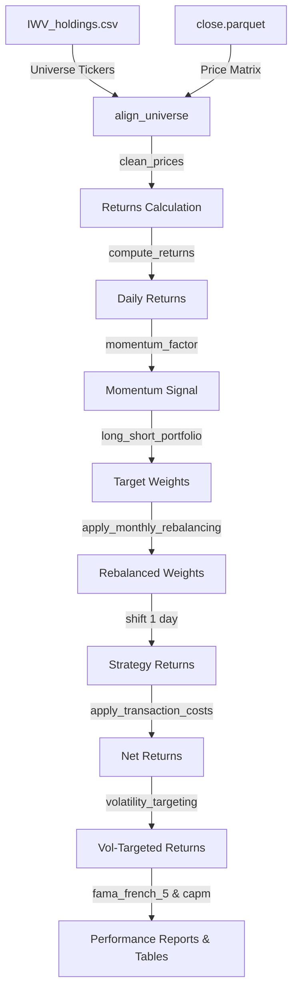

# Multi-Factor Asset Pricing & Systematic Trading Framework

## Overview
This project implements a full empirical asset pricing and systematic trading research framework in Python.

It studies cross-sectional equity return predictability using momentum strategies and classical factor models, including CAPM and the Fama-French 5-factor model.

The framework includes realistic market frictions such as transaction costs and volatility targeting.

---

## Research Objectives

- Test whether momentum signals predict cross-sectional stock returns
- Evaluate CAPM and Fama-French 5-factor explanatory power
- Measure performance after transaction costs
- Analyze robustness under volatility targeting
- Assess statistical significance of alpha

---

## Models Implemented

### Asset Pricing Models
- CAPM regression
- Fama-French 5-factor model:
  - Market (MKT_RF)
  - Size (SMB)
  - Value (HML)
  - Profitability (RMW)
  - Investment (CMA)

### Trading Strategy
- Cross-sectional momentum factor
- Long-short equity portfolio
- Monthly rebalancing

---

## Portfolio Construction

- Stocks ranked by momentum signal
- Long top quantile
- Short bottom quantile
- Equal-weighted within each bucket
- Monthly rebalanced portfolio

---

## Risk Adjustments

- Transaction costs (turnover-based, in basis points)
- Volatility targeting (risk scaling using rolling volatility)

---

## Data

- Daily OHLCV equity data (local parquet files)
- Russell 3000 universe (IWV holdings CSV)

⚠️ Note:
The dataset is subject to survivorship bias because it uses a static current index universe and does not include delisted securities.

---

## Methodology

1. Load price data
2. Compute returns
3. Construct momentum signal
4. Build long-short portfolio
5. Apply monthly rebalancing
6. Apply transaction costs
7. Apply volatility targeting
8. Evaluate performance metrics

---

## Performance Metrics

- Sharpe Ratio
- Cumulative Returns
- CAPM Alpha
- Factor Loadings (Fama-French)
- t-statistics for statistical significance

---

## Tech Stack

- Python
- pandas
- numpy
- statsmodels
- scikit-learn
- matplotlib
- pyarrow

---

## Project Structure
- `src/`: Codebase modules (data loader, signal generation, backtest, statistics, regressions, reporting).
- `scripts/prepare_data.py`: Prepares stock parquet data and downloads Kenneth French's daily 5 factors.
- `main.py`: Main backtest execution and regression reporting script.
- `data/`: Contains database and factor cache parquet files.
- `results/`: Stores backtest metrics and plots.
- `reports/`: Stores regression report tables in Markdown/text.

---

## Getting Started

1. **Install Dependencies**:
   ```bash
   pip install -r requirements.txt
   ```

2. **Prepare Data**:
   Ensure `IWV_holdings.csv` is on the Desktop and `historical_prices.csv` is in the `momentumlab` data folder, then run:
   ```bash
   python scripts/prepare_data.py
   ```

3. **Run Backtest & Regressions**:
   ```bash
   python main.py
   ```

---

## System Architecture Diagram



---

## Important Notes

- This project is for research and educational purposes
- Results may be affected by survivorship bias 
- Universe construction is based on current iShares Russell 3000 holdings. This introduces survivorship bias as historical index membership is not available.

